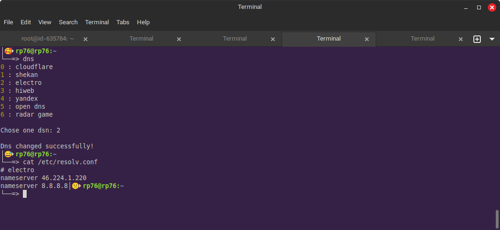

> این یه کد خیلی ساده هست که بخاطر مشکلی که داشتم نوشتم
> 
> مشکلم این بود که توی بازی بتونم dns رو زود عوض کنم.

# Fast Dns Changer

> اگر dns که می‌خواید توی لیست نیست فقط کافیه فایل `dbs` رو ادیت کنید

```
# cloudflare
nameserver 1.1.1.1

# shekan
nameserver 178.22.122.100
nameserver 185.51.200.2
```

> باید با همین قاعده `dns` جدید اضافه کنید.

 
> کد زیر رو هم توی فایل `~/.bashrc` اضافه کنید

```bash
alias dns="sudo node ~/www/DnsChanger/main.js"
```